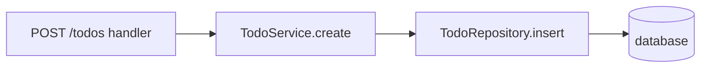

## In one sentence

The code is split into layers with one responsibility each — handlers deal with HTTP, services hold business rules, repositories talk to the database — and each layer only calls the one below.

## Analogy

A restaurant: the waiter takes orders (handler), the chef decides how to cook (service), the pantry keeps ingredients (repository). The waiter never goes to the pantry.

## Why it matters

Business rules don't get tangled with HTTP or SQL, so they're easier to test, reuse (from a job, a CLI, another endpoint) and change. Swapping the database or framework touches one layer.

## In code

The handler parses the request and maps errors to status codes; the service enforces "max 100 open todos per user"; the repository runs the SQL.

## Common mistakes

- Business rules in the handler ("fat controllers") — they can't be reused by a background job.
- Services that receive `req`/`res` — now they depend on HTTP.
- Adding layers to a tiny app where they're pure ceremony. Layers should earn their place.

## Good questions

- **Explain why**: Why does the "max 100 todos" rule live in the service and not in the handler?
- **What if**: We need a nightly job that creates todos. Which layers can it reuse?
- **Choose**: For a 3-endpoint prototype, would you keep all three layers? Why?

## Going deeper

Dependency injection, hexagonal architecture (ports and adapters), CQRS.
